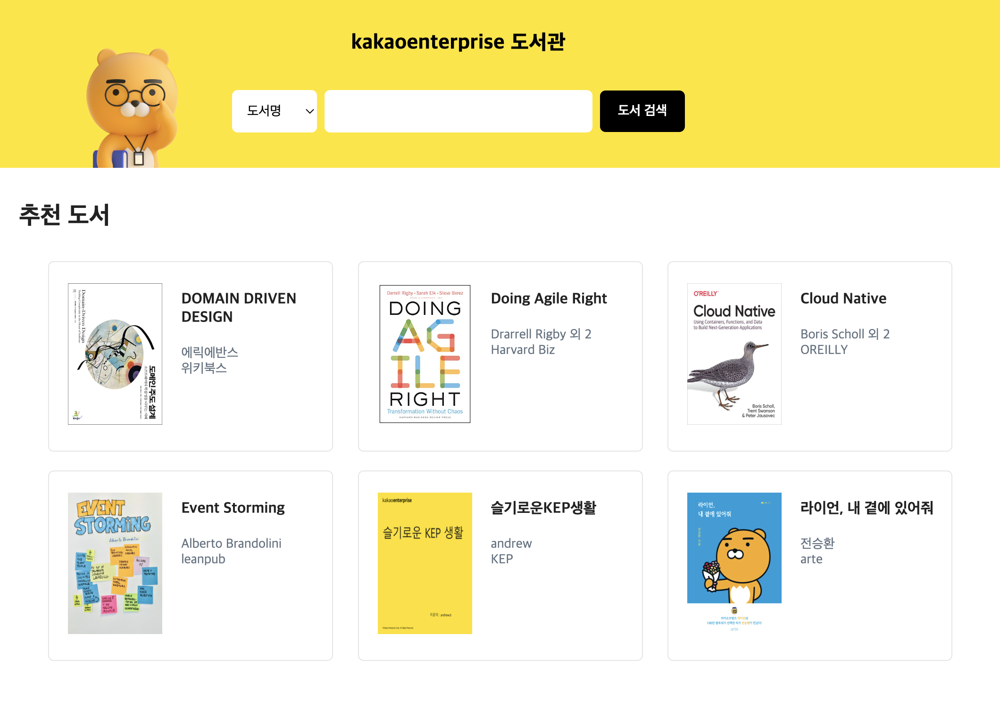

# kakaoenterprise-library-react
kakao i cloud hands-on example project.\
The react version of [[library-monolithic]](https://github.com/kep-cloudnative/library-monolithic.git).


## Quick Start (Local)
1. Run Backend Application
   1. Build
      ```shell
      # move to working directory ex) */library-react
      $ ./gradlew build
      ```
   2. Execute 
      ```shell
      java -jar -Dspring.profiles.active=local \
      ./build/libs/library-react-SNAPSHOT.jar
      ```
2. Run React Application
   ```shell
   cd ./client
   npm install
   npm start
   ```

## Deployment

### Environment
```text
os: ubuntu 20.04
java-version: 11
node-version: 18.13
```
install requirements
```shell
cd ${PROJECT_DIR}
bash install-requirements.sh
```


### Backend
   1. Edit app-env.sh
      ```shell
      # move to working directory ex) */library-react
      $ vi app-env.sh
      ```
      ```shell
      # ...
      # port MYSQL_HOST='172.16.227.224'
      # port DB_USERNAME='admin'
      # port DB_PASSWORD='root1234'
      ```
   2. Build/Run application
      ```shell
      bash app-build.sh
      bash start-app.sh
      ```
### Frontend
   1. Edit web-env.sh
      ```shell
      cd ./client
      vi ./web-env.sh
      ```
      ```shell
      # export APP_ENDPOINT="http://localhost:8080" <- Backend Application's endpoint
      # ...
      ```
   2. Build
      ```shell
      bash web-build.sh
      ```
   3. Deploy with web-server(Nginx)
      ```shell
      bash start-web.sh
      ```